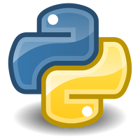

### Hi there 👋

**About me**

- 💼 I'm QA Engineer, https://www.linkedin.com/in/polina-mokretsova-361525230/

**Languages and Tools:**

<code></code>
<code></code>
<code></code>
<code></code>
<code></code>
<code></code>
<code></code>
<code></code>
<code></code>

# Диплом
<code></code>

По итогам обучения в <a href="QA.GURU">QA.GURU</a> представляю дипломную работу.
Работа состоит из трех частей: UI, API и Mobile App.

**Проект UI автотестов**
------------------------
<a href="https://github.com/PolinaMokretsova/demoqa_tests"> Github</a>

<a href="https://jenkins.autotests.cloud/job/demoqa_tests/">  Jenkins</a>

<a href="https://allure.autotests.cloud/"> Allure TestOps Dashboard</a>

**Проект API автотестов**
------------------------
<a href="https://github.com/PolinaMokretsova/api_tests"> Github</a>

<a href="https://jenkins.autotests.cloud/job/api_tests/"> Jenkins</a>

<a href="https://allure.autotests.cloud/"> Allure TestOps Dashboard</a>

**Проект Mobile автотестов**
------------------------
<a href="https://github.com/PolinaMokretsova/browserstack_tests"> Github</a>

<a href="https://jenkins.autotests.cloud/job/browserstack_tests/"> Jenkins</a>

<a href="https://allure.autotests.cloud/"> Allure TestOps Dashboard</a>
